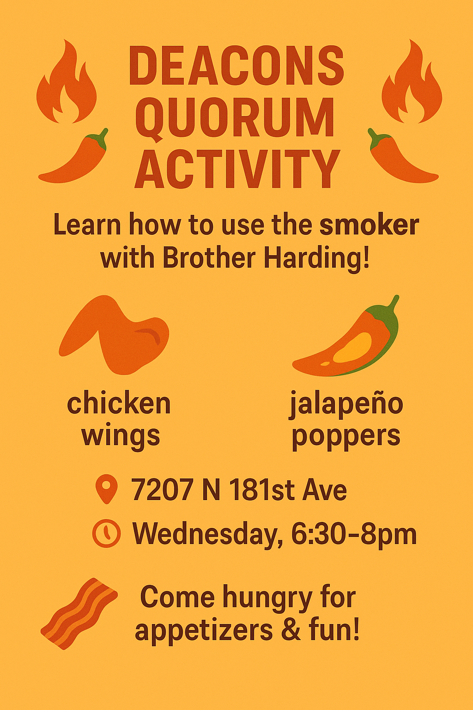

For this week’s activity:

🔥 Brother Harding (one of our Amazing chefs from summer camp) will teach us how to use the smoker and cook up some tasty chicken wings 🍗 + jalapeño poppers 🌶🧀.

📍 Meet at Brother McGinnis’ house – 7207 N 181st Ave

⏰ Wednesday, 6:30–8pm

🥓 Come hungry—we’ll be making and eating appetizers!

